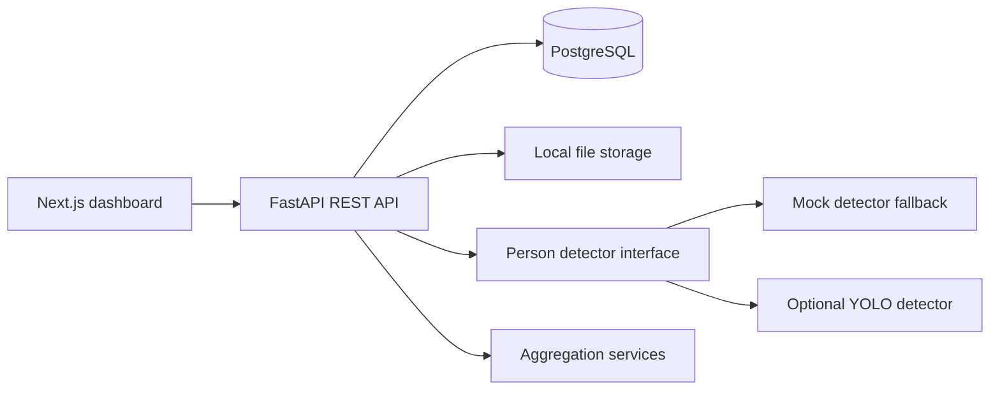

# Smart Seat and Facility Congestion Analysis System

An end-to-end full-stack application for estimating facility congestion from uploaded images, storing analysis history, and presenting operational analytics for spaces such as libraries, classrooms, study rooms, and cafes.

This repository is built as a strong MVP/portfolio foundation: FastAPI backend, PostgreSQL persistence, Alembic migrations, a modular computer-vision layer, JWT admin auth, a Next.js dashboard, Docker Compose, seed data, and tests for the core analytics logic.

## Architecture



## Tech Stack

- Frontend: Next.js App Router, TypeScript, Tailwind CSS, Recharts
- Backend: FastAPI, Pydantic, SQLAlchemy 2, Alembic
- Database: PostgreSQL
- Auth: JWT bearer tokens with bcrypt password hashing
- Storage: local upload and annotated-image directories
- CV: swappable detector interface with deterministic mock fallback and optional YOLO support
- DevOps: Docker Compose for Postgres, backend, and frontend

## Features

- Public facility list with current people count, available seats, occupancy rate, and congestion badge
- Facility detail page with metadata, image, current status, upload-and-analyze flow, annotated result preview, history chart, and recent logs
- Admin login with seeded demo account
- Admin dashboard with summary metrics, busiest facilities ranking, peak-hour chart, and recent system activity
- Admin facility management for create, edit, and delete
- Persistent uploads, analyses, and occupancy logs
- Analytics endpoints for overview, facility history, peak hours, daily trend, and rankings
- Defensive congestion calculation with clamping and zero-seat handling
- Alembic migration and seed/demo data
- Backend unit tests for congestion and analytics helpers

## Screenshots

Add portfolio screenshots here after running locally:

- Home dashboard
- Facility detail with annotated detection preview
- Facility live monitoring page
- Admin analytics dashboard
- Facility management page

## Local Setup With Docker

Prerequisites:

- Docker Desktop

Run the full stack:

```bash
docker compose up --build
```

The backend container runs migrations and seeds demo data automatically.

Open:

- Frontend: http://localhost:3000
- Backend API docs: http://localhost:8000/docs
- Health check: http://localhost:8000/health

Demo admin account:

- Email: `admin@example.com`
- Password: `admin12345`

## Local Setup Without Docker

Backend:

```bash
cd backend
python -m venv .venv
source .venv/bin/activate
pip install -r requirements.txt
cp .env.example .env
alembic upgrade head
python -m app.db.seed
uvicorn app.main:app --reload
```

Frontend:

```bash
cd frontend
npm install
cp .env.example .env.local
npm run dev
```

For non-Docker local backend development, update `backend/.env` so `DATABASE_URL` points to your local PostgreSQL instance.

## Environment Variables

Backend:

- `DATABASE_URL`: SQLAlchemy database URL
- `SECRET_KEY`: JWT signing secret
- `CORS_ORIGINS`: JSON list of allowed frontend origins
- `PUBLIC_BASE_URL`: base URL used for generated media links
- `STORAGE_DIR`: local storage directory
- `CV_BACKEND`: `mock` or `yolo`
- `YOLO_MODEL`: YOLO weights name/path when `CV_BACKEND=yolo`
- `YOLO_CONFIDENCE_THRESHOLD`: minimum person-detection confidence, default `0.25`
- `YOLO_DEVICE`: optional Ultralytics device string such as `cpu`, `mps`, or `0`
- `YOLO_FALLBACK_TO_MOCK`: when true, failed YOLO initialization falls back to the deterministic mock detector
- `LIVE_PERSIST_INTERVAL_SECONDS`: minimum seconds between saved live samples for a facility, default `60`
- `SEED_ADMIN_EMAIL`, `SEED_ADMIN_PASSWORD`: demo admin credentials

Frontend:

- `NEXT_PUBLIC_API_BASE_URL`: API root, typically `http://localhost:8000/api`
- `INTERNAL_API_BASE_URL`: server-side API root used by Next.js inside Docker, typically `http://backend:8000/api`

## Database Migrations

Run migrations from the backend directory:

```bash
alembic upgrade head
```

Create a new migration after model changes:

```bash
alembic revision --autogenerate -m "describe change"
```

## How Analysis Works

1. A user uploads an image for a facility.
2. The backend saves an `uploads` record and the image file.
3. The analysis service calls the configured `PersonDetector`.
4. The detector returns people count and optional bounding boxes.
5. Occupied seats are estimated as `min(people_count, total_seats)`.
6. `available_seats = max(total_seats - occupied_seats, 0)`.
7. `occupancy_rate = occupied_seats / total_seats`, with zero-seat facilities handled as 0.
8. Congestion level is assigned as:
   - Low: 0.00 to 0.30
   - Medium: 0.31 to 0.70
   - High: 0.71+
9. The backend stores both an `analyses` row and an `occupancy_logs` row.
10. If detections include boxes, an annotated image is generated for display.

The default detector is a deterministic mock so the project runs immediately without downloading model weights. The mock count is deterministic: it opens the image to read width and height, adds those dimensions to the byte sum of the stored filename, calculates `seed % 9`, then clamps the result to 1-8 people. Its boxes are synthetic layout boxes spread across the image, not real detections.

The real detector path uses Ultralytics YOLO and filters detections to the `person` class. The detector is selected through `CV_BACKEND`, cached for reuse, and can fall back to mock if model loading fails.

Enable YOLO without Docker:

```bash
cd backend
pip install -r requirements-ml.txt
CV_BACKEND=yolo YOLO_MODEL=yolov8n.pt uvicorn app.main:app --reload
```

Enable YOLO with Docker:

```bash
BACKEND_REQUIREMENTS_FILE=requirements-ml.txt CV_BACKEND=yolo YOLO_MODEL=yolov8n.pt docker compose up --build
```

Keep `YOLO_FALLBACK_TO_MOCK=true` for demos where model downloads or hardware acceleration may be unavailable. Set it to `false` when you want startup/analysis to fail loudly if YOLO cannot initialize.

The Occupancy Trend chart consumes `/api/facilities/{facility_id}/history`, sorts records oldest-first, and aggregates records into 5-minute, hourly, or daily buckets based on the visible time range. This keeps rapid live/manual test uploads from making the trend look like a misleading second-by-second sawtooth while preserving raw recent events in the table below.

## Live Monitoring Mode

The first live monitoring implementation is browser-camera driven and available at:

- `/facilities/{facility_id}/live`

The route is facility-scoped because congestion math depends on the facility capacity. From a facility detail page, use **Open live monitor** to launch it.

How it works:

1. The browser asks for camera access with `getUserMedia`.
2. The live page shows a video preview.
3. Every 3 seconds, the frontend captures the current video frame into an offscreen canvas.
4. The frame is encoded as JPEG and sent to `POST /api/live/analyze`.
5. The backend saves transient frames only long enough to run the configured detector.
6. The same detector and congestion logic used by uploads returns people count, occupied seats, available seats, occupancy rate, congestion level, and congestion score.
7. The frontend prevents overlapping requests, so a slow detector cannot create a request storm.

Persistence strategy:

- Live mode does **not** save every frame.
- The UI sends frames every 3 seconds for near-real-time estimates.
- If persistence is enabled, the backend saves at most one live sample per facility every `LIVE_PERSIST_INTERVAL_SECONDS`.
- Default save interval is 60 seconds.
- Persisted live samples reuse the existing `uploads`, `analyses`, and `occupancy_logs` tables, so admin analytics and facility history continue to work.
- Non-persisted frames are deleted after analysis.

This MVP intentionally uses polling-style frame snapshots instead of WebSockets or a server-side stream worker. The service layer is structured so later work can add RTSP/CCTV ingestion, background polling, WebSocket/SSE status pushes, or per-camera schedules without replacing the upload pipeline.

## API Highlights

Public/user:

- `GET /api/facilities`
- `GET /api/facilities/{facility_id}`
- `GET /api/facilities/{facility_id}/status`
- `GET /api/facilities/{facility_id}/history`
- `POST /api/uploads`
- `POST /api/uploads/analyze`
- `POST /api/analyze`
- `POST /api/live/analyze`
- `GET /api/analyses/{analysis_id}`

Admin:

- `POST /api/auth/login`
- `GET /api/admin/facilities`
- `POST /api/admin/facilities`
- `PUT /api/admin/facilities/{facility_id}`
- `DELETE /api/admin/facilities/{facility_id}`
- `GET /api/admin/analytics/overview`
- `GET /api/admin/analytics/facilities/{facility_id}`

## Testing

Backend tests:

```bash
cd backend
pytest
```

Frontend validation:

```bash
cd frontend
npm run build
```

## Current Limitations

- Seat-level occupancy is estimated from people detection and total capacity; no dedicated seat detector/classifier is included yet.
- Live monitoring uses browser frame snapshots over HTTP; server-side RTSP/CCTV ingestion is structured for future work but not implemented yet.
- Local filesystem storage is used for MVP simplicity; cloud object storage can be added behind the storage service.
- The mock detector is deterministic and useful for demos, but not real CV inference.
- Admin auth is intentionally simple and should be extended with refresh tokens, user management, and stricter production security controls.

## Future Improvements

- Add a real seat detector/classifier and camera calibration per facility
- Add live camera frame sampling with configurable schedules
- Add RTSP/CCTV ingestion workers and WebSocket or SSE live updates
- Add alert thresholds and notification channels
- Add CSV export for facility analytics
- Add object storage support for S3/GCS
- Add Playwright end-to-end tests for upload and admin workflows
- Add role-based access beyond the seeded admin
- Add model confidence summaries and detector health telemetry

## Resume-Style Highlights

- Designed a full-stack, database-backed facility analytics platform with FastAPI, Next.js, PostgreSQL, SQLAlchemy, Alembic, and Docker Compose
- Implemented modular CV inference architecture with a YOLO-ready detector interface and graceful mock fallback
- Built historical occupancy tracking, congestion scoring, peak-hour analytics, and busiest-facility ranking queries
- Created JWT-protected admin workflows for facility management and operational monitoring
- Added migration, seed, and test coverage to support reproducible local demos and continued development
