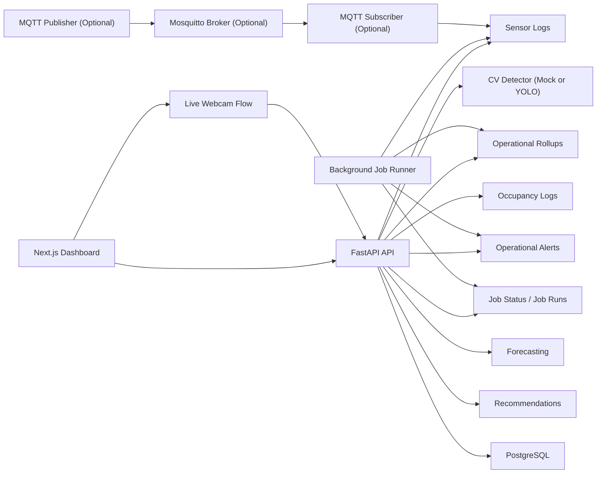

# Smart Place Analytics

Smart Place Analytics is a real-time facility operations analytics platform for libraries, lounges, classrooms, cafes, and study spaces. It combines computer-vision occupancy analysis, telemetry ingestion, time-series persistence, operational rollups, forecasting, recommendations, background jobs, operational alerts, and dashboard visualization in a single full-stack project built to be runnable locally and easy to explain in interviews.

## Problem

Shared facilities often rely on delayed manual reporting, isolated camera feeds, or ad hoc spreadsheets to understand occupancy, congestion, and operational conditions. That makes it hard to answer practical questions such as:

- How crowded is a space right now?
- Which facilities are running hot or underused?
- Is telemetry fresh, stale, or missing?
- Are rollups and alerts updating on schedule?
- What operational action should a team take next?

## Solution

Smart Place Analytics turns those signals into a unified operations workflow:

- image upload and live webcam analysis estimate occupancy and congestion
- sensor telemetry enters through simulator-first and optional MQTT paths
- time-series logs persist occupancy and environmental signals in PostgreSQL
- periodic rollups summarize facility behavior
- forecasting estimates near-term congestion
- recommendations and operational alerts translate data into action
- job audit trails make the background pipeline observable

## Why this project is portfolio-ready

- End-to-end full-stack architecture with a real API, database, UI, and Docker workflow
- Multiple ingestion paths: upload, live monitoring, background jobs, and optional MQTT
- Time-series analytics, rollups, alerts, forecasting, and recommendations in one system
- Production-minded touches: migrations, CI, test coverage, auth, health checks, config-driven services

## Architecture



For a more detailed system breakdown, see [ARCHITECTURE.md](/Users/yoonjaeseong/Desktop/projects/smart_place_analytics/ARCHITECTURE.md).

## Core features

- Facility list and facility detail dashboards
- Image upload analysis with persisted occupancy results
- Live monitoring page using browser webcam capture
- Occupancy time-series logging with congestion metrics
- Synthetic telemetry generation for temperature, humidity, power, door count, and noise
- Optional MQTT telemetry ingestion using Mosquitto, publisher, and subscriber scripts
- Periodic facility rollups for operational summaries
- Background job runner with `JobRun` audit trail
- Operational alerts for stale telemetry, overdue rollups, high congestion, and energy mismatch
- Baseline occupancy forecasting
- Rule-based operational recommendations
- Admin login and facility management
- GitHub Actions CI plus backend/frontend validation

## Tech stack

- Frontend: Next.js App Router, TypeScript, Tailwind CSS, Recharts
- Backend: FastAPI, Pydantic, SQLAlchemy 2, Alembic
- Database: PostgreSQL
- Auth: JWT bearer tokens
- CV: swappable detector abstraction with mock default and YOLO-ready path
- Telemetry: simulator scripts, background jobs, optional MQTT via Mosquitto and `paho-mqtt`
- Tooling: Docker Compose, pytest, ESLint, GitHub Actions

## Backend architecture

- `backend/app/api/`: REST routes for facilities, uploads, live analysis, admin, and operations
- `backend/app/services/`: business logic for analysis, congestion, sensors, rollups, forecasting, recommendations, alerts, and job runner
- `backend/app/models/`: SQLAlchemy models for facilities, analyses, logs, rollups, alerts, and job runs
- `backend/alembic/`: database migrations
- `backend/scripts/`: simulator, background job, and MQTT publisher/subscriber utilities

## Frontend architecture

- `frontend/app/`: App Router pages for home, facilities, facility detail, live monitoring, and admin flows
- `frontend/components/`: reusable dashboard widgets, cards, charts, upload analyzer, and live monitor
- `frontend/lib/`: API client and formatting helpers
- `frontend/types/`: shared TypeScript API response types

## Data pipeline overview

### Occupancy analysis path

```text
uploaded image or live webcam frame
  -> FastAPI analysis endpoint
  -> detector service (mock or YOLO)
  -> congestion logic
  -> analyses / occupancy_logs persistence
  -> facility dashboard, history chart, forecast, recommendations
```

### Background operations path

```text
background job runner
  -> synthetic sensor generation
  -> SensorLog persistence
  -> FacilityOperationalRollup computation
  -> alert refresh
  -> JobRun audit trail
  -> operations status endpoints and dashboard card
```

### MQTT demo path

```text
MQTT publisher
  -> Mosquitto broker
  -> MQTT subscriber
  -> payload validation
  -> SensorLog persistence
  -> existing rollups, alerts, and dashboard views
```

### Scenario-driven demo path

```text
run_demo_scenario.py
  -> correlated OccupancyLog + SensorLog generation
  -> optional rollup computation
  -> optional alert refresh
  -> existing forecast, recommendation, and dashboard views
```

## Forecasting and recommendations

- Forecasting uses a simple baseline model: moving averages plus same-hour historical blending when available
- Recommendations use current occupancy, forecast, and sensor context to generate operational actions
- This keeps the platform explainable and extensible without pretending a heavyweight ML pipeline already exists

## Demo scenarios

The repository includes a scenario-based generator so the app can present realistic operational stories instead of only generic synthetic data.

- `exam_week_congestion`
  - occupancy rises through the afternoon
  - door count and noise level rise with occupancy
  - high congestion alerts appear
  - recommendations suggest redirecting traffic or opening overflow space
- `low_occupancy_energy_waste`
  - occupancy remains low
  - power draw stays unusually high
  - energy mismatch alerts appear
  - recommendations suggest reducing lighting or HVAC usage
- `telemetry_outage`
  - occupancy history exists
  - recent sensor data is missing
  - stale telemetry alerts appear
  - the Operations Pipeline card becomes a stronger observability demo
- `normal_day`
  - realistic but healthy occupancy and sensor behavior
  - charts look active and stable
  - severe alerts are less likely

## Background jobs and rollups

- `backend/scripts/run_operations_jobs.py` runs a lightweight recurring loop
- It can generate synthetic telemetry, compute rollups, refresh alerts, and write `JobRun` audit rows
- `FacilityOperationalRollup` stores periodic summaries such as average occupancy, peak occupancy, high-congestion events, and energy/environmental aggregates
- This makes the app feel like an operations system, not just a request/response dashboard

## Testing and CI

- Backend tests: `pytest`
- Frontend validation: `npm run lint` and `npm run build`
- GitHub Actions runs backend tests and frontend build checks
- Default local validation does not require MQTT to be running

## Local setup

### Option 1: Docker

Run the default stack:

```bash
docker compose up --build
```

Open:

- Frontend: [http://localhost:3000](http://localhost:3000)
- API docs: [http://localhost:8000/docs](http://localhost:8000/docs)
- Health check: [http://localhost:8000/health](http://localhost:8000/health)

Demo admin:

- Email: `admin@example.com`
- Password: `admin12345`

### Option 2: Local backend + frontend

Backend:

```bash
cd backend
python -m venv .venv
source .venv/bin/activate
pip install -r requirements.txt
cp .env.example .env
alembic upgrade head
python -m app.db.seed
uvicorn app.main:app --reload
```

Frontend:

```bash
cd frontend
npm install
cp .env.example .env.local
npm run dev
```

## Optional demo modes

### Background jobs

Docker profile:

```bash
docker compose --profile operations up --build
```

Local script:

```bash
cd backend
python scripts/run_operations_jobs.py --interval-seconds 30 --iterations 0 --generate-sensors --compute-rollups
```

### Sensor simulator

Docker profile:

```bash
docker compose --profile simulator up --build
```

Local script:

```bash
cd backend
python scripts/simulate_sensor_stream.py --interval-seconds 5 --iterations 0
```

### Optional MQTT demo

Docker profile:

```bash
docker compose --profile mqtt up --build
```

Local subscriber:

```bash
cd backend
python scripts/subscribe_sensor_mqtt.py --host localhost --port 1883
```

Local publisher:

```bash
cd backend
python scripts/publish_sensor_mqtt.py --host localhost --port 1883 --facility-id 1 --interval-seconds 5 --iterations 0
```

Verify MQTT ingestion:

- `GET /api/facilities/{facility_id}/sensor-logs`
- `GET /api/operations/job-status`
- facility detail `Operations Pipeline` card

### Scenario-driven demo data

Exam-week congestion:

```bash
cd backend
python scripts/run_demo_scenario.py --scenario exam_week_congestion --facility-id 1 --clear-existing --compute-rollups --refresh-alerts
```

Low-occupancy energy waste:

```bash
cd backend
python scripts/run_demo_scenario.py --scenario low_occupancy_energy_waste --facility-id 1 --clear-existing --compute-rollups --refresh-alerts
```

Telemetry outage:

```bash
cd backend
python scripts/run_demo_scenario.py --scenario telemetry_outage --facility-id 1 --clear-existing --compute-rollups --refresh-alerts
```

Normal day:

```bash
cd backend
python scripts/run_demo_scenario.py --scenario normal_day --facility-id 1 --clear-existing --compute-rollups --refresh-alerts
```

Use these scenarios to drive the dashboard, alerts, recommendations, forecast cards, and Operations Pipeline card without changing application logic.

## API overview

High-level endpoint groups:

- facilities, status, history, occupancy logs, sensor logs, rollups
- uploads and live analysis
- operations job status, job runs, alerts
- forecast and recommendations
- admin facility management and analytics

Detailed route list lives in [API_REFERENCE.md](/Users/yoonjaeseong/Desktop/projects/smart_place_analytics/API_REFERENCE.md).

## Screenshots and GIF placeholders

Add real assets later; do not fabricate them.

- `docs/media/dashboard-overview.png`  
  Placeholder for the facility detail dashboard with occupancy, sensor, forecast, and recommendations cards.
- `docs/media/live-monitoring.gif`  
  Placeholder for the live webcam monitoring flow.
- `docs/media/operations-pipeline-card.png`  
  Placeholder for the Operations Pipeline health card with job status and alerts.
- `docs/media/mqtt-demo-terminal.png`  
  Placeholder for side-by-side MQTT publisher/subscriber terminal output.
- `docs/media/forecast-recommendations.png`  
  Placeholder for forecast and recommendation UI cards.

When you add them, reference them from this README and from `DEMO.md`.

Suggested screenshot flow after running scenarios:

- `exam_week_congestion` -> capture high congestion indicators plus overflow-style recommendations
- `low_occupancy_energy_waste` -> capture energy mismatch alert and optimization recommendation
- `telemetry_outage` -> capture stale telemetry alert in the Operations Pipeline section
- `normal_day` -> capture a healthy, active dashboard state

## Current limitations

- Seat occupancy is inferred from detected people rather than true seat-level classification
- Forecasting is baseline statistical logic, not trained ML forecasting
- Recommendations are rule-based and deterministic
- Live monitoring is browser snapshot polling, not RTSP/CCTV ingestion
- MQTT is optional local-demo ingestion only
- Local MQTT broker has no auth or TLS
- No production queue, cloud IoT service, or distributed scheduler yet
- Alerts are lightweight operational signals, not a full incident workflow

## Planned improvements

- RTSP/CCTV sampling workers
- stronger forecasting with scikit-learn or XGBoost
- richer alert lifecycle and acknowledgement flow
- subscriber health metrics and MQTT connection telemetry
- cloud object storage and deployment hardening
- end-to-end browser tests

## GitHub metadata suggestions

Suggested repository topics:

- `fastapi`
- `nextjs`
- `postgresql`
- `computer-vision`
- `mqtt`
- `time-series`
- `operations-analytics`
- `dashboard`
- `docker`
- `portfolio-project`

## Portfolio highlights

- Built a real-time facility operations analytics platform using Next.js, FastAPI, PostgreSQL, Docker, and computer vision to monitor occupancy and congestion
- Designed a time-series analytics pipeline for occupancy, sensor telemetry, rollups, and operational alerts
- Implemented forecasting and recommendation APIs to predict near-term congestion and suggest operational actions
- Added background job audit trails and optional MQTT ingestion to simulate an industrial IoT operations workflow

## Additional docs

- [DEMO.md](/Users/yoonjaeseong/Desktop/projects/smart_place_analytics/DEMO.md)
- [API_REFERENCE.md](/Users/yoonjaeseong/Desktop/projects/smart_place_analytics/API_REFERENCE.md)
- [ARCHITECTURE.md](/Users/yoonjaeseong/Desktop/projects/smart_place_analytics/ARCHITECTURE.md)
